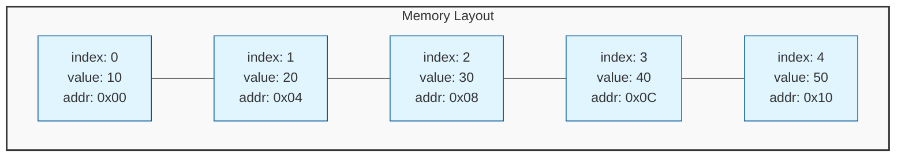

# Arrays & Strings

> [!NOTE]
> **Core Concept**: Arrays and strings are the foundational building blocks of data storage. They represent contiguous blocks of memory, offering **O(1)** access but requiring **O(n)** time for insertions and deletions.

Arrays and strings are the **most fundamental data structures** in programming. Mastering them is essential for solving most coding problems, as they form the basis for more complex structures like Hash Tables, Heaps, and Matrices.

---

## Visual Representation

### Array Memory Layout
Arrays are stored in **contiguous** memory locations. This linear arrangement allows the computer to calculate the address of any element instantly using the formula:
`Address = Base_Address + (Index × Element_Size)`



---

## Arrays

An array is a collection of items stored at contiguous memory locations. The idea is to store multiple items of the same type together.

### Complexity Analysis

| Operation | Time Complexity | Explanation |
|-----------|-----------------|-------------|
| **Access** | **O(1)** | Direct calculation via index. |
| **Search** | **O(n)** | In the worst case, you must check every element. |
| **Insertion** | **O(n)** | Requires shifting subsequent elements to make space. |
| **Deletion** | **O(n)** | Requires shifting subsequent elements to fill the gap. |

> [!TIP]
> **Dynamic Arrays**: Languages like Python (`list`), Java (`ArrayList`), and JavaScript (`Array`) use dynamic arrays that resize automatically. Appending to the end is **amortized O(1)**, but resizing (when full) takes **O(n)**.

### Common Operations

```multi
[javascript]
// --- Creation ---
const arr = [1, 2, 3, 4, 5];
const zeros = new Array(5).fill(0); // [0, 0, 0, 0, 0]

// --- Access (O(1)) ---
const first = arr[0];
const last = arr[arr.length - 1];

// --- Modification ---
arr.push(6);           // Add to end - O(1)
arr.unshift(0);        // Add to start - O(n) - shifts elements
arr.pop();             // Remove last - O(1)
arr.splice(2, 1);      // Remove at index 2 - O(n)

// --- Traversal ---
for (let i = 0; i < arr.length; i++) {
    console.log(arr[i]);
}
// Functional approach
arr.forEach(num => console.log(num));

[python]
# --- Creation ---
arr = [1, 2, 3, 4, 5]
zeros = [0] * 5  # [0, 0, 0, 0, 0]

# --- Access (O(1)) ---
first = arr[0]
last = arr[-1]  # Pythonic negative indexing

# --- Modification ---
arr.append(6)      # Add to end - O(1) amortized
arr.insert(0, 0)   # Insert at start - O(n)
arr.pop()          # Remove last - O(1)
arr.pop(0)         # Remove first - O(n)

# --- Slicing (O(k)) ---
sub = arr[1:4]     # [2, 3, 4]
rev = arr[::-1]    # Reverse

[java]
// --- Creation ---
int[] staticArr = {1, 2, 3, 4, 5}; // Fixed size
ArrayList<Integer> list = new ArrayList<>(); // Dynamic

// --- Access (O(1)) ---
int first = staticArr[0];
// list.get(0);

// --- Modification ---
// staticArr cannot be resized
list.add(6);          // Add to end - O(1)
list.add(0, 0);       // Insert at start - O(n)
list.remove(list.size() - 1); // Remove last

// --- Traversal ---
for (int num : staticArr) {
    System.out.println(num);
}

[cpp]
// --- Creation ---
int arr[] = {1, 2, 3, 4, 5}; // Static
vector<int> vec = {1, 2, 3, 4, 5}; // Dynamic

// --- Access (O(1)) ---
int first = vec[0];
int last = vec.back();

// --- Modification ---
vec.push_back(6);     // Add to end - O(1)
vec.insert(vec.begin(), 0); // Insert at start - O(n)
vec.pop_back();       // Remove last - O(1)

// --- Traversal ---
for (int x : vec) {
    cout << x << endl;
}
```

---

## Strings

Strings are sequences of characters. In many modern languages (Java, Python, JavaScript), strings are **immutable**, meaning they cannot be changed after creation. Any "modification" actually creates a new string.

> [!WARNING]
> **Immutability Performance**: Since strings are immutable in Python and Java, repeated concatenation (e.g., in a loop) can be **O(n²)** because a new string is created each time. Use `StringBuilder` (Java) or `list.join` (Python) for **O(n)** performance.

### String Basics

```multi
[javascript]
const s = "Hello, World!";

// Access
const char = s[0]; // 'H'

// Common Methods
const lower = s.toLowerCase();
const parts = s.split(", "); // ["Hello", "World!"]
const hasWord = s.includes("World");

// Template Literals
const name = "Alice";
const greeting = `Hello, ${name}!`;
[python]
s = "Hello, World!"

# Access
char = s[0] # 'H'

# Common Methods
lower = s.lower()
parts = s.split(", ") # ["Hello", "World!"]
has_word = "World" in s

# Formatting
name = "Alice"
greeting = f"Hello, {name}!"
[java]
String s = "Hello, World!";

// Access
char c = s.charAt(0); // 'H'

// Common Methods
String lower = s.toLowerCase();
String[] parts = s.split(", "); 
boolean hasWord = s.contains("World");

// StringBuilder (Mutable)
StringBuilder sb = new StringBuilder();
sb.append("Hello");
sb.append(", ");
sb.append("World!");
String result = sb.toString();
[cpp]
string s = "Hello, World!";

// Access
char c = s[0]; // 'H'

// Common Methods
// Modern C++ usually involves standalone functions or methods
s += " More text"; // Mutable in C++
size_t pos = s.find("World"); // Returns index or string::npos
string sub = s.substr(0, 5); // "Hello"
```

---

## Key Algorithmic Patterns

Mastering arrays requires understanding a few key patterns that appear repeatedly in coding interviews.

### 1. Two Pointers
Efficient for searching pairs in sorted arrays or reversing structures.
*   **Time**: O(n)
*   **Space**: O(1)

> **Use Case**: Checking palindromes, reversing arrays, finding pairs in sorted arrays.

```javascript
// Example: Reverse Array
function reverse(arr) {
  let left = 0, right = arr.length - 1;
  while (left < right) {
    [arr[left], arr[right]] = [arr[right], arr[left]]; // Swap
    left++;
    right--;
  }
}
```

### 2. Sliding Window
Used to perform operations on a specific window size of the array or find a subarray meeting certain criteria.
*   **Time**: O(n)
*   **Space**: O(1)

> **Use Case**: Maximum sum of `k` consecutive elements, longest substring with distinct characters.

### 3. Prefix Sum
Pre-computation technique to allow O(1) range sum queries.
*   **Time**: O(n) to build, O(1) per query
*   **Space**: O(n)

> **Use Case**: "Sum of elements between index `i` and `j`?"

---

## Essential Practice Questions

| Difficulty | Problem | Concept |
|:---:|---|---|
| 🟢 | **Two Sum** | Hash Map / Two Pointers |
| 🟢 | **Valid Anagram** | Frequency Counter |
| 🟡 | **Longest Substring Without Repeating Characters** | Sliding Window |
| 🟡 | **Product of Array Except Self** | Prefix/Suffix Array |
| 🔴 | **Sliding Window Maximum** | Monotonic Deque |

> [!IMPORTANT]
> Start with the **Two Sum** problem in the practice section to verify your understanding of using Hash Maps with Arrays.
