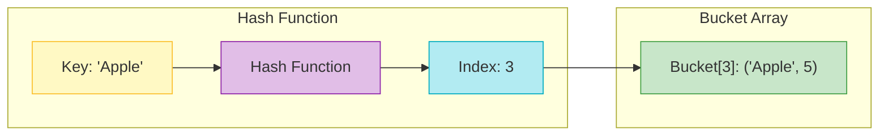
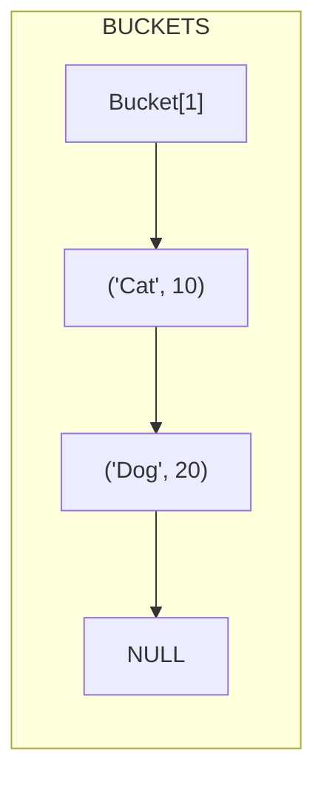

# Hashing

> [!NOTE]
> **Core Concept**: **Hashing** is like a library's filing system. Instead of searching every shelf for a book, you use the book's title to calculate exactly which shelf it's on. This provides **O(1)** average access time.

Hash tables (or Hash Maps) are arguably the most important data structure for coding interviews. They trade space for time, allowing for constant-time lookups.

---

## Visual Representation



### Collision Resolution: Chaining
When two keys hash to the same index, we store them in a list at that index.



---

## Core Operations

| Operation | Average Case | Worst Case | Description |
|-----------|--------------|------------|-------------|
| `put(key, val)` | **O(1)** | O(n) | Insert key-value pair. |
| `get(key)` | **O(1)** | O(n) | Retrieve value by key. |
| `remove(key)` | **O(1)** | O(n) | Remove pair by key. |
| `containsKey(key)`| **O(1)** | O(n) | Check if key exists. |

> [!WARNING]
> **Worst Case O(n)**: This happens when many keys collide at the same index (e.g., a bad hash function puts everything in Bucket 0). Modern languages use randomization or tree-based buckets (Java 8+) to mitigate this.

---

## Implementation

### Hash Table with Chaining

```multi
[javascript]
class HashTable {
    constructor(size = 50) {
        this.buckets = new Array(size).fill(null).map(() => []);
        this.size = size;
    }
    
    _hash(key) {
        let hash = 0;
        for (let char of key.toString()) {
            hash = (hash + char.charCodeAt(0)) % this.size;
        }
        return hash;
    }
    
    set(key, value) {
        const index = this._hash(key);
        const bucket = this.buckets[index];
        const existing = bucket.find(item => item.key === key);
        
        if (existing) {
            existing.value = value; // Update
        } else {
            bucket.push({ key, value }); // Insert
        }
    }
    
    get(key) {
        const index = this._hash(key);
        const bucket = this.buckets[index];
        const item = bucket.find(item => item.key === key);
        return item ? item.value : undefined;
    }
}
[python]
class HashTable:
    def __init__(self, size=50):
        self.size = size
        self.buckets = [[] for _ in range(size)]
        
    def _hash(self, key):
        return hash(key) % self.size
        
    def put(self, key, value):
        index = self._hash(key)
        bucket = self.buckets[index]
        
        for i, (k, v) in enumerate(bucket):
            if k == key:
                bucket[i] = (key, value) # Update
                return
        bucket.append((key, value)) # Insert
        
    def get(self, key):
        index = self._hash(key)
        bucket = self.buckets[index]
        
        for k, v in bucket:
            if k == key:
                return v
        return None
[java]
// Simplified implementation
class HashTable<K, V> {
    private class Entry<K, V> {
        K key;
        V value;
        Entry<K, V> next;
        
        public Entry(K key, V value) {
            this.key = key;
            this.value = value;
        }
    }
    
    private Entry<K, V>[] buckets;
    private int size;
    
    public HashTable(int size) {
        this.size = size;
        this.buckets = new Entry[size];
    }
    
    private int hash(K key) {
        return Math.abs(key.hashCode()) % size;
    }
    
    public void put(K key, V value) {
        int index = hash(key);
        Entry<K, V> head = buckets[index];
        
        while (head != null) {
            if (head.key.equals(key)) {
                head.value = value; // Update
                return;
            }
            head = head.next;
        }
        
        Entry<K, V> newEntry = new Entry<>(key, value);
        newEntry.next = buckets[index];
        buckets[index] = newEntry; // Insert at head
    }
}
[cpp]
#include <vector>
#include <list>

template <typename K, typename V>
class HashTable {
private:
    std::vector<std::list<std::pair<K, V>>> buckets;
    int size;
    
    int hash(K key) {
        return std::hash<K>{}(key) % size;
    }
    
public:
    HashTable(int size = 50) : size(size) {
        buckets.resize(size);
    }
    
    void put(K key, V value) {
        int index = hash(key);
        for (auto& pair : buckets[index]) {
            if (pair.first == key) {
                pair.second = value; // Update
                return;
            }
        }
        buckets[index].push_back({key, value}); // Insert
    }
};
```

---

## Common Algorithmic Patterns

### 1. Frequency Counter
Count occurrences of elements.

```javascript
const count = {};
for (const char of "banana") {
    count[char] = (count[char] || 0) + 1;
}
// { b: 1, a: 3, n: 2 }
```

### 2. Two Sum
Find two numbers that add up to a target.
*   **Time**: O(n)
*   **Space**: O(n)

> **Strategy**: Store `(target - current_number)` in the hash map. As you iterate, check if the current number is in the map.

```javascript
function twoSum(nums, target) {
    const map = new Map();
    for (let i = 0; i < nums.length; i++) {
        const complement = target - nums[i];
        if (map.has(complement)) {
            return [map.get(complement), i];
        }
        map.set(nums[i], i);
    }
    return [];
}
```

### 3. Group Anagrams
Group strings that share the same characters.
*   **Key Idea**: Use a stored version of the string (e.g., "aet" for "tea") as the hash key.

---

## Essential Practice Questions

| Difficulty | Problem | Concept |
|:---:|---|---|
| 🟢 | **Two Sum** | Hash Map Lookup |
| 🟢 | **Contains Duplicate** | Hash Set |
| 🟡 | **Group Anagrams** | Key Generation |
| 🟡 | **Top K Frequent Elements** | Frequency Map + Heap |
| 🟡 | **Longest Consecutive Sequence** | Hash Set O(1) Check |

> [!IMPORTANT]
> **Longest Consecutive Sequence** is a classic interview question where a Hash Set allows for an **O(n)** solution by enabling O(1) lookups for sequence neighbors, avoiding O(n log n) sorting.
