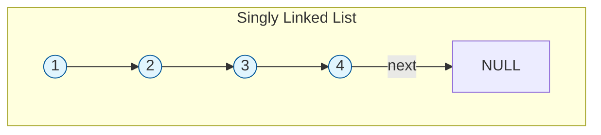
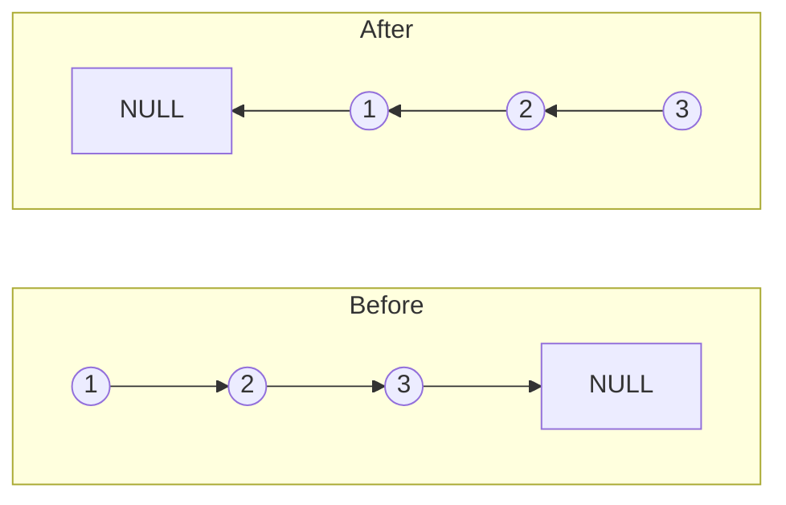

# Linked Lists

> [!NOTE]
> **Core Concept**: A Linked List is a linear data structure where elements are not stored in contiguous memory. Instead, each element (node) points to the next, creating a chain.

Unlike arrays, Linked Lists act like a scavenger hunt: you must find the first item to know where the next one is. This flexibility allows for efficient **O(1)** insertions and deletions at the beginning, but makes access slower (**O(n)**).

---

## Visual Representation

### Singly Linked List
Each node contains **data** and a **next** pointer.



### Doubly Linked List
Each node has **prev**, **data**, and **next**. Allows traversal in both directions.

```mermaid
graph LR
    subgraph Doubly Linked List
        direction LR
        NULL1[NULL] <-- prev -- A((1))
        A -- next --> B((2))
        B -- prev --> A
        B -- next --> C((3))
        C -- prev --> B
        C -- next --> NULL2[NULL]
    end
    style A fill:#e8f5e9,stroke:#2e7d32
    style B fill:#e8f5e9,stroke:#2e7d32
    style C fill:#e8f5e9,stroke:#2e7d32
```

---

## Complexity Analysis

| Operation | Array | Linked List | Explanation |
|-----------|-------|-------------|-------------|
| **Access** | **O(1)** | **O(n)** | Must traverse from Head to find `k-th` element. |
| **Search** | **O(n)** | **O(n)** | Scan linearly. |
| **Insert (Head)** | O(n) | **O(1)** | Just update the Head pointer. |
| **Insert (Tail)** | O(1)* | **O(1)** | With a Tail pointer (else O(n)). |
| **Delete (Head)** | O(n) | **O(1)** | Just update the Head pointer. |

> [!TIP]
> **When to use**: Use Linked Lists when you need constant-time insertions/deletions at the start or end and don't require random access (like accessing the 500th element directly).

---

## Implementation

### Singly Linked List Structure

```multi
[javascript]
class ListNode {
    constructor(val = 0, next = null) {
        this.val = val;
        this.next = next;
    }
}

class LinkedList {
    constructor() {
        this.head = null;
        this.size = 0;
    }
    
    // O(1)
    insertAtHead(val) {
        const newNode = new ListNode(val, this.head);
        this.head = newNode;
        this.size++;
    }
    
    // O(n) without tail pointer
    insertAtTail(val) {
        const newNode = new ListNode(val);
        if (!this.head) {
            this.head = newNode;
            return;
        }
        let current = this.head;
        while (current.next) {
            current = current.next;
        }
        current.next = newNode;
        this.size++;
    }
}
[python]
class ListNode:
    def __init__(self, val=0, next=None):
        self.val = val
        self.next = next

class LinkedList:
    def __init__(self):
        self.head = None
        self.size = 0
    
    def insert_at_head(self, val):
        # O(1)
        new_node = ListNode(val, self.head)
        self.head = new_node
        self.size += 1
    
    def insert_at_tail(self, val):
        # O(n)
        new_node = ListNode(val)
        if not self.head:
            self.head = new_node
            return
        current = self.head
        while current.next:
            current = current.next
        current.next = new_node
        self.size += 1
[java]
class ListNode {
    int val;
    ListNode next;
    ListNode(int val) { this.val = val; }
}

class LinkedList {
    ListNode head;
    int size;
    
    // O(1)
    public void insertAtHead(int val) {
        ListNode newNode = new ListNode(val);
        newNode.next = head;
        head = newNode;
        size++;
    }
    
    // O(n)
    public void insertAtTail(int val) {
        ListNode newNode = new ListNode(val);
        if (head == null) {
            head = newNode;
            return;
        }
        ListNode current = head;
        while (current.next != null) {
            current = current.next;
        }
        current.next = newNode;
        size++;
    }
}
[cpp]
struct ListNode {
    int val;
    ListNode* next;
    ListNode(int x) : val(x), next(nullptr) {}
};

class LinkedList {
    ListNode* head;
public:
    LinkedList() : head(nullptr) {}
    
    // O(1)
    void insertAtHead(int val) {
        ListNode* newNode = new ListNode(val);
        newNode->next = head;
        head = newNode;
    }
    
    // O(n)
    void insertAtTail(int val) {
        ListNode* newNode = new ListNode(val);
        if (!head) {
            head = newNode;
            return;
        }
        ListNode* current = head;
        while (current->next) {
            current = current->next;
        }
        current->next = newNode;
    }
};
```

---

## Common Algorithmic Patterns

### 1. Fast & Slow Pointers (Tortoise & Hare)
A powerful technique for analyzing structure without extra space.
*   **Time**: O(n)
*   **Space**: O(1)

> **Use Cases**: Detecting cycles, finding the middle node, finding the start of a cycle.

**Middle of Linked List**:
```javascript
function findMiddle(head) {
    let slow = head, fast = head;
    while (fast && fast.next) {
        slow = slow.next;       // 1 step
        fast = fast.next.next;  // 2 steps
    }
    return slow; // When fast reaches end, slow is at middle
}
```

### 2. Reversing a Linked List
The classic interview problem. It requires manipulating pointers precisely.



```python
def reverse_list(head):
    prev = None
    current = head
    while current:
        next_node = current.next  # Save next
        current.next = prev       # Reverse arrow
        prev = current            # swift prev
        current = next_node       # shift current
    return prev  # New head
```

---

## Essential Practice Questions

| Difficulty | Problem | Concept |
|:---:|---|---|
| 🟢 | **Reverse Linked List** | Pointer Manipulation |
| 🟢 | **Linked List Cycle** | Fast & Slow Pointers |
| 🟢 | **Merge Two Sorted Lists** | Dummy Node, Pointers |
| 🟡 | **Remove Nth Node From End** | Two Pointers (Gap) |
| 🟡 | **Reorder List** | Middle, Reverse, Merge |
| 🔴 | **Merge k Sorted Lists** | Min-Heap / Divide & Conquer |

> [!IMPORTANT]
> Mastery of **Fast & Slow Pointers** is crucial. It converts O(n) space problems (using a set to track visited nodes) into O(1) space solutions.
